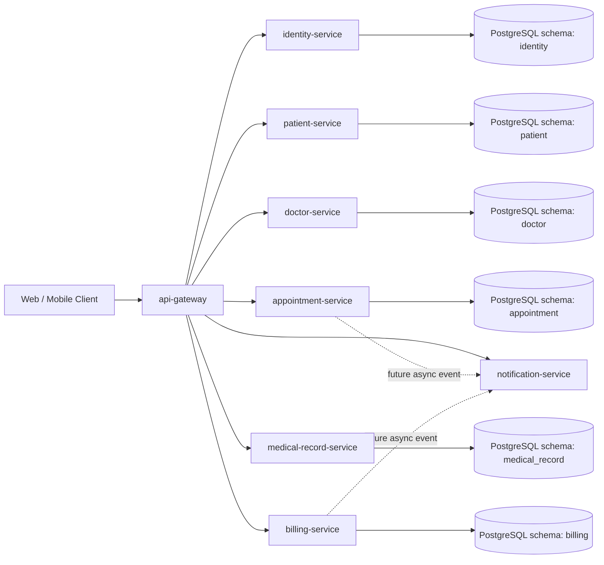
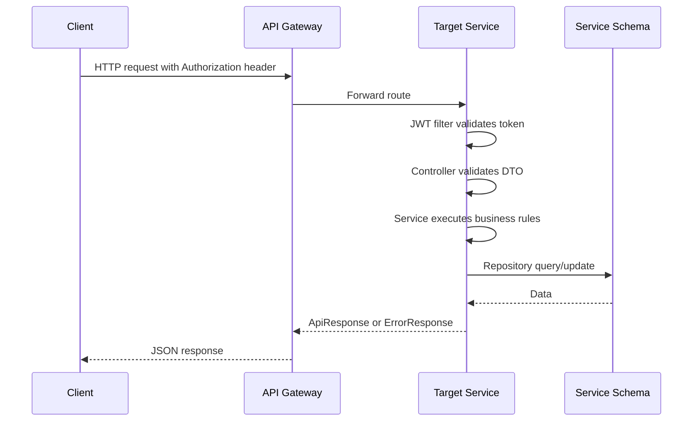
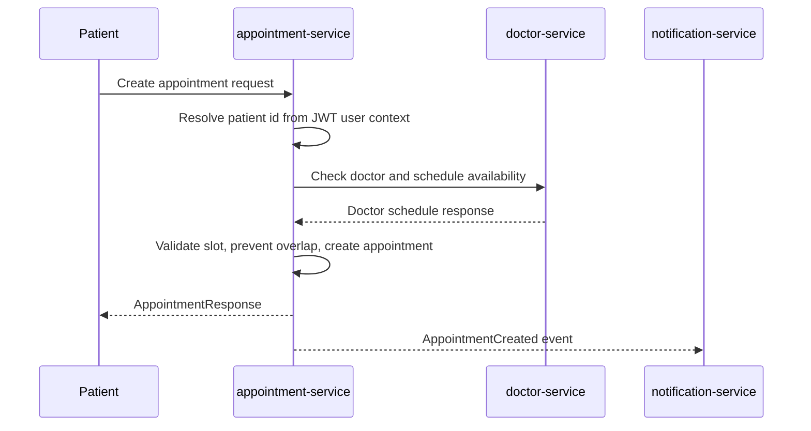

# Architecture Overview

## 1. System Purpose

Clinic Management System is a microservice-based backend for clinic operations:

- user registration, login, role management
- patient profile management
- doctor profile, specialty, and schedule management
- appointment booking and visit coordination
- medical record and prescription management
- billing and payment tracking
- notification delivery

The backend is organized as a Maven multi-module project under `backend/`.

## 2. High-Level Components

## 3. Backend Modules

| Module | Responsibility | Current status |
| --- | --- | --- |
| `common-lib` | Shared API wrappers, error codes, business exception base classes | Implemented foundation |
| `api-gateway` | Single entry point and route dispatch to backend services | Route config exists |
| `identity-service` | Auth, users, roles, JWT access tokens, refresh tokens | Core flow implemented |
| `patient-service` | Patient profile data linked to identity user id | Profile flow implemented |
| `doctor-service` | Doctor profile, specialties, schedules | Directory, profile, weekly schedule, and availability APIs implemented |
| `appointment-service` | Appointment booking, confirmation, cancellation, completion | Core lifecycle implemented with patient/doctor service checks |
| `medical-record-service` | Diagnosis, medical record, prescriptions | Core record and prescription workflow implemented |
| `billing-service` | Invoices and payment state | Core invoice and payment-state workflow implemented |
| `notification-service` | Notification request persistence, status tracking, and delivery foundation | Foundation implemented; RabbitMQ/provider integration pending |

## 4. Runtime Ports

| Service | Port | Gateway path currently configured |
| --- | ---: | --- |
| `api-gateway` | 8080 | Entry point |
| `identity-service` | 8083 | `/api/auth/**`, `/api/users/**` |
| `patient-service` | 8084 | `/api/patients/**` |
| `doctor-service` | 8085 | `/api/doctors/**`, `/api/specialties/**` |
| `appointment-service` | 8086 | `/api/appointments/**` |
| `medical-record-service` | 8087 | `/api/medical-records/**`, `/api/prescriptions/**` |
| `billing-service` | 8088 | `/api/invoices/**` |
| `notification-service` | 8089 | `/api/notifications/**` |

## 5. Service Ownership Model

Each service owns its own data model and schema:

- `identity-service` owns users, roles, refresh tokens.
- `patient-service` owns patient profile fields and stores `user_id` as an external reference.
- `doctor-service` owns doctor profile, specialty, and schedule data and stores `user_id` as an external reference.
- `appointment-service` owns appointment lifecycle and stores `patient_id` and `doctor_id` as external references.
- `medical-record-service` owns medical records and prescriptions.
- `billing-service` owns invoice and payment state.
- `notification-service` owns notification templates, delivery status, retries, and provider integration when implemented.

Rules:

- A service must not directly query another service's schema.
- Cross-service relationships are stored as UUID references, not cross-schema foreign keys.
- Any data needed from another service must come from an API call, Feign client, or event payload.
- A service may duplicate a small read model only when eventual consistency is acceptable and the duplication is maintained by events.

## 6. Request Flow

## 7. Appointment Booking Target Flow

The first implementation can use synchronous Feign calls for doctor availability. Notification should be event-driven once a broker is added.

## 8. Consistency Strategy

Use local transactions inside each service. Avoid distributed transactions.

Recommended approach:

- Appointment creation is the source of truth for appointment state.
- Medical record creation should require a completed appointment.
- Billing invoice generation should be triggered after appointment completion or medical record finalization.
- Notification delivery should be asynchronous and retryable.
- State-changing APIs should be idempotent when duplicate client submissions are realistic.

## 9. Security Model

Identity service issues JWTs. Resource services validate JWTs and construct a `CurrentUserPrincipal`.

Rules:

- Public endpoints: login, register, token refresh, health checks.
- Protected endpoints: profile, appointment, medical record, billing, admin operations.
- Use the authenticated principal as the source for current user id.
- Use roles for cross-actor operations: patient, doctor, receptionist, admin.
- Never trust user identity fields from request bodies when the token already provides identity.

## 10. API Versioning Note

The current code and gateway are configured with `/api/...` paths. The preferred long-term standard is `/api/v1/...`.

Do not introduce `/api/v1` in one service only. API versioning must be handled as one coordinated change:

- update controllers
- update gateway routes
- update API docs
- update integration tests
- keep backward compatibility or document the breaking change

## 11. Current Architecture Gaps

These are known gaps to handle in later implementation phases:

- Appointment synchronous service calls currently use Spring `RestClient`; OpenFeign standardization can be handled in a later refactor.
- Resilience patterns such as timeout, retry, circuit breaker, and fallback are not yet implemented.
- Notification service is not yet event-driven.
- Docker Compose now provides a local backend runtime with Prometheus and Grafana monitoring; production deployment assets are still future work.
- Some implemented services use direct service classes instead of interface + impl; future non-trivial services should use the interface + implementation pattern.
- Centralized security code is duplicated across services and can later be extracted or standardized carefully.
