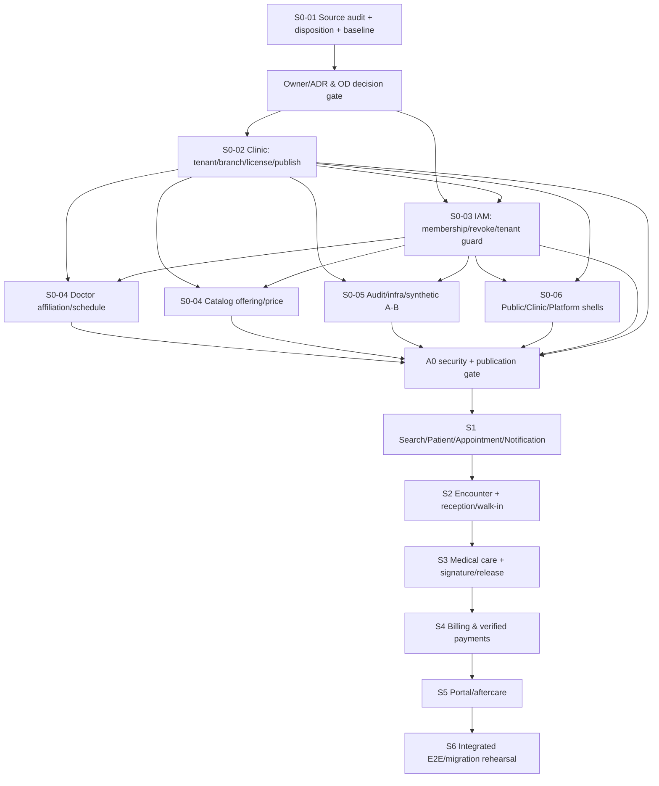

# P05-S0-01 — Integration dependencies and S0 scope baseline

**Status:** S0 scope **FROZEN FOR ENGINEERING PLANNING**, pending PO/Tech/Security/Clinic owner approval before source implementation. No OPEN OD or technical ADR is implicitly approved. **P05-S0-01 static audit completed; A0 NOT VERIFIED.**

## 1. End-to-end dependency map

**Important:** Clinic and Identity may develop on agreed versioned contracts, but a clinic/branch FK or permission is never accepted from an unverified client header. S0 has no completed E2E journey; only a safe foundation capable of reaching A0.

## 2. Bounded-context ownership and integration contracts to agree BEFORE code

| Edge | Request/event owner | Required contract/guard | Why S0 or future |
|---|---|---|---|
| Identity ↔ Clinic | Clinic owns clinic/branch existence; IAM owns membership and active grants | Id/version, status, branch membership proof and revoke epoch; no self-minted membership | S0-02/03 |
| Gateway/BFF → IAM/owner service | IAM provides live context; domain owner resolves resource owner | Context from authenticated token plus verified membership; `X-Clinic-Id` is a request, not permission; 403/404 disclosure policy | S0-03 |
| Clinic → public projection | Clinic owns approval/publication, Search owns eventually consistent approved view | publication version/status; no private license evidence/PHI; booking revalidation | S0 creates source and contract; S1 projection |
| Clinic ↔ Doctor | Doctor owns practitioner affiliation/schedule/absence | Verified clinic/branch, effective scope, doctor ref and schedule version; OD-04 affects pool semantics | S0-04 |
| Clinic ↔ Catalog | Catalog owns offering, branch price/version | Branch scope, active/public flags, immutable price version/snapshot contract | S0-04 |
| Tenant-scoped writes → Audit | Domain owns mutation; audit owner appends scope/outcome | Tenant/branch, actor, object, reason, UTC, correlation and non-PHI payload | S0-05 |
| S0 shell → IAM/Clinic | UI consumes context and publication/workspace services | Guest route; authorized switch; clear old queries/cache, subscriptions and downloads; denied/empty/error/pending | S0-06 |
| S1 booking → Clinic/Doctor/Catalog | Appointment command owner revalidates owner services | Published status, valid affiliation and price; Search is hint only; OD-01/02/03/04 gates | S1 |
| S1 Appointment → S2 Encounter | Encounter owns actual visit, appointment is optional reference | Idempotent check-in, visit ref and branch, one active queue; walk-in null appointment | S2; do not extend V1 compulsory FK |
| S2 Encounter → S3 Medical | Medical owns clinical truth | Encounter/assignment/tenant scope, separate order/result/review/document release, signature evidence | S3; OD-05/06/07 |
| S3 clinical charge source → S4 Billing | Billing owns charge/bill/payment/ledger | Unique tenant-scoped source/version and immutable price snapshot; no charge from UI total | S4 |
| S1 conditional deposit → Billing | Billing validates provider/merchant, Appointment owns hold | Idempotent signed webhook and late-payment exception; blocked until OD-01/02/03 approved | S1-05 conditional |
| Medical release/Payment → Portal/Notification | Source owner authorizes; projections only | Released-only secure fetch, patient/guardian revoke, non-PHI event | S5 |

**Contract decision:** P03 `contracts/openapi.yaml` is **representative** (not all P0 APIs); owner must issue full versioned request/response/error/event schema and consumer-driven tests. `/api/v2` is a proposed prefix, not a permission to break V1.

## 3. S0 implementation scope — INCLUDED (six tasks; no additional dashboard CRUD)

| Task | Output required | Acceptance evidence required (planned, NOT RUN) | Dependencies |
|---|---|---|---|
| **S0-01** audit | Six reports in this directory; AS-IS/target gap, migration and risk; baseline source revision | Evidence map + review of proposed disposition; no claimed runtime PASS | Already authored in this task, owner review pending |
| **S0-02** Clinic | Tenant/branch entity, license evidence private, submission/review/approve/publish/suspend, separate platform approval | AT-001/002/003/048/050; no public draft or unaudited self-approval; suspend blocks new activity without deleting history | OD-11 review; IAM/Clinic contract |
| **S0-03** IAM + security | Membership/branch grant, active context, revoke on next call, object+assignment guard interface, tenant-safe DB access/RLS | AT-004/026/035/043/046/049; ARCH-01/02/03; denial with stale token and connection reuse | Clinic existence; ADR A01/A02 and OD-06 deny default |
| **S0-04** Doctor + Catalog | Practitioner affiliation/branch schedule; clinic/branch offering and effective price version, snapshot contract | AT-005/016/045; cannot edit B via A, change price does not overwrite historical snapshot | S0 Clinic/IAM; OD-04 scope |
| **S0-05** Platform/DevOps | Structured append-only audit and non-PHI event envelope, correlation, synthetic A/B/branch fixtures, backup/restore/replay test plan | AT-038/039/068; ARCH-15/16 *planned*; actual restore/broker test required before VERIFIED | IAM/Clinic; OD-09 targets and infrastructure ADR |
| **S0-06** UX/QA | Public guest shell, Clinic Workspace shell, distinct Platform Console access, context indicator, auth expiry/denied/empty/partial states | UX-A09/10/23/24/25, keyboard/mobile and API-owned data; no mock mistaken for real behavior | IAM/Clinic contracts and P04 UX signoff |

**S0 deliverable semantics:** public shell may show no published clinics until real owner/projection exists; do not claim S1 public search or full booking from a static mock. Workspace shell may display only authorized membership/branch and foundation admin screens. Platform Ops is a separate capability; Clinic Owner/Admin never acquires platform authority merely through a global `ROLE_ADMIN`.

## 4. OUT OF S0 / staged interfaces only

- Production public Search indexing/filter ranking, registration-to-booking and hold/TTL/idempotent confirmation belong to **S1**; only their interface is planned in S0. No real deposit when OD-01/02/03 OPEN.
- Walk-in encounter, check-in/queue and exception handling belong to **S2**; S0 only decides the Encounter bounded context/owner boundary, and does not fabricate a booking.
- Medical form, lab result review, clinical signature/version/addendum/release belong to **S3**; S0 may define interfaces, not claim legally compliant signing.
- Full charge/bill/direct-and-online payment/partial/refund/settlement belong to **S4**; only conditional Billing thin-path in S1 when explicitly approved.
- Patient portal released documents/follow-up, notification business flows, role reporting/day close belong to **S5**.
- Production/pilot readiness, migration on isolated copy, cutover, restore/rollback rehearsal and both E2E journeys belong to **S6**. S0 must prepare plans and synthetic environments, not migrate live V1.

## 5. A0 gate — no S1 expansion until the evidence exists

| Gate evidence | Expected result | Status now |
|---|---|---|
| Clinic registration→Ops review→approved→published/suspended | Clinic publication/source API or preview exposes only approved fields, no self-approval and old records intact; full Search projection belongs to S1 | NOT IMPLEMENTED/NOT RUN |
| A staff member with A but not B guesses B UUID for GET/PUT | Deny without B data/mutation and log | NOT IMPLEMENTED/NOT RUN |
| Same staff has A+B grants and switches A→B→A | Correct branch, fresh cache, no previous tenant records or download URL | NOT IMPLEMENTED/NOT RUN |
| Revoke current membership with still-valid access token | Next authorized action denied, old caches invalidated | NOT IMPLEMENTED/NOT RUN |
| DB pooled connection missing or wrong server-derived context | Fail closed, no cross-tenant reads/writes, no leaked GUC | NOT IMPLEMENTED/NOT RUN |
| Doctor affiliation A/B; catalog price branch version | Branch B unaffected by A change; historic price snapshot immutable | NOT IMPLEMENTED/NOT RUN |
| Audit/restore/event | Actor/resource/outcome/scope/correlation; synthetic restore drill; broker replay/dedup | NOT IMPLEMENTED/NOT RUN |
| UX states | Guest/public, verified staff tenant switch, denied/expired/empty states working via real contracts | NOT IMPLEMENTED/NOT RUN |

**Status transitions:** PLANNED → IMPLEMENTED (code) → INTEGRATED (live owner contracts) → VERIFIED (actual test evidence) → ACCEPTED (owner signoff). This audit only covers the *planning/evidence* step.

## 6. Parallel work and collision policy

- After approved source/ownership decision, **Track A** Clinic+IAM+Security; **Track B** Doctor+Catalog; **Track C** public/workspace shells and API contracts; **Track D** audit/infra/QA. All can build different files but must review shared schema/version/event envelopes.
- The present task uses an isolated Workbench checkout. A source path, file, migration, Git index or shell process shared by another task is not assumed to be ours; do not reset/restore/stash/clean/commit others' work.
- Proposed `v2/apps/{public-web,clinic-workspace,platform-console}`, `v2/services`, `v2/contracts` and isolated infra are **not yet created or approved**. Deployment topology, whether Encounter is a service/module, broker choice and DB separation need ADR decision.
- If a concurrent task updates the same source after revision `e6ab0d4...`, refresh audit evidence and resolve diff before implementation.
