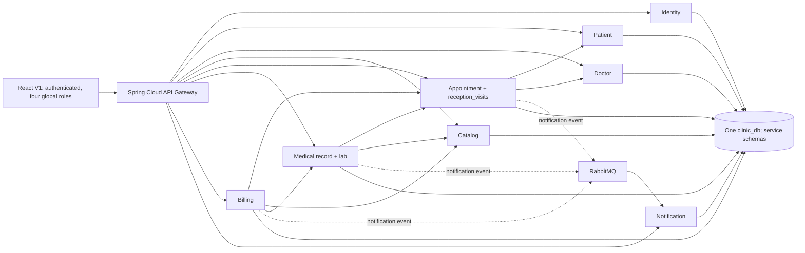

# P05-S0-01 — V1 inventory (AS-IS)

**Audit date:** 2026-09-29 · **Status:** STATIC SOURCE REVIEW COMPLETE; runtime/DB/test execution NOT VERIFIED.  
**Task:** Clinic Management V2 / `6820c6b7-522a-4a2c-9f1b-b05d2184fb36` · **Workspace:** `D:\MainDV\Clinic-management` · **Checkout:** `local-coder/clinic-management-v2-6820c6b7` at `e6ab0d4f45e0779dff82e555f990ab043614a5c6`.  
**Read-only constraint:** audit source and package docs; no V1 source, database, Docker volume, runtime state or Git history changed. `docs/clinic-v2/` is a separate, pre-existing untracked import from the same task. This report is an audit artifact; it is NOT part of the original P01–P05 SHA256 manifest.

## 1. Source-of-truth / evidence rules

- Product target: `docs/clinic-v2/02_Product_Requirements/PRD_Clinic_Management_V2.md`, `Role_Permission_Matrix.md`, `Acceptance_Test_Matrix.md`, `Decision_Log.md` (P02).
- Proposed solution: `03_Architecture_and_Database/01..10_*.md` (P03), `04_UX_UI_and_Prototypes/docs/01_*,05_*,06_*,07_*` (P04); implementation backlog and gates under `05_Implementation_Delivery/` (P05).
- P01 `05_V1_Gap_Analysis.md` is explicitly **pre-audit**, not proof of V1 defects. Paths and line ranges below are current source evidence. Historical `backend/billing-service/README.md` has task-specific claims that may be stale; prefer present implementation.
- This is source-level evidence, **not** executed behavior. An existing test file means test coverage exists in source, not that it passes or proves live integration.

## 2. Technology / deployment inventory

| Area | AS-IS evidence | Limit/implication |
|---|---|---|
| Backend | Maven parent `backend/pom.xml:14-25`: Java 21, Spring Boot 3.3.5, Spring Cloud 2023.0.3; 10 modules (common-lib + gateway + eight domain services) | Existing conventions/client and error wrapping are possible reusable components |
| Frontend | `frontend/package.json:6-24`: React, TypeScript, Vite, Vitest; `frontend/src/app/App.tsx:34-43,141-195,202-258` | One auth-gated app; not independent public and workspace channels |
| Database | `docker-compose.yml:1-16,20-199`; `infra/postgres/init/01-create-schemas.sql:1-7` | One PostgreSQL cluster/database `clinic_db`, distinct schemas, shared runtime superuser account. P03 production credential/data isolation is not yet present |
| Broker/notifications | `docker-compose.yml:203-258` RabbitMQ, Mailpit, notification; publisher/consumer classes present | V1 event payload and ownership must be versioned/redesigned for tenant-safe V2 |
| Gateway/observability | `backend/api-gateway/src/main/resources/application.yml:25-57`; `docker-compose.yml:260-334` | One gateway, Prometheus/Grafana; no channel-specific BFF or tenant context resolution |
| Frontend route strategy | `frontend/src/app/App.tsx:219-256`, `frontend/src/utils/roles.ts:5-36` | UI uses in-memory `activeView`, priority-selected global role; no per-clinic/branch context switch |
| Local/deployment | `docker-compose.yml:1-339`; `backend/**/application*.yml`; `frontend/vite.config.ts` | Runtime endpoints/config available, but no health/test probe was executed during this audit |

The current service ports are gateway 8080 internally (8090 host), identity 8083, patient 8084, doctor 8085, appointment 8086, medical 8087, billing 8088, notification 8089, catalog 8091. Gateway route predicates: identity `/api/auth/**,/api/users/**`; patient `/api/patients/**`; doctor `/api/doctors/**,/api/specialties/**`; catalog `/api/catalog/**`; appointment `/api/appointments/**`; medical `/api/medical-records/**,/api/prescriptions/**`; billing `/api/invoices/**`; notification `/api/notifications/**` (`backend/api-gateway/src/main/resources/application.yml:25-57`).

## 3. Actual module / migration / test source count

Counts are of Java files under each module, controller filenames, Java test files and Flyway SQL files found in this checkout; do not infer test pass from counts.

| Module | Java files | Controllers | Java test files | Flyway versions |
|---|---:|---:|---:|---|
| api-gateway | 9 | 1 | 2 | — |
| common-lib | 4 | 0 | 0 | — |
| identity-service | 47 | 4 | 10 | V1,V2,V4,V5 |
| patient-service | 27 | 3 | 6 | V1–V3 |
| doctor-service | 44 | 3 | 8 | V1–V5 |
| catalog-service | 24 | 2 | 2 | V1–V2 |
| appointment-service | 75 | 5 | 15 | V1–V5 |
| medical-record-service | 75 | 3 | 9 | V1–V10 |
| billing-service | 48 | 1 | 8 | V1–V7 |
| notification-service | 47 | 1 | 9 | V1–V3 |

Frontend source inventory: 88 `.tsx`, 45 `.ts`, 26 `.css`, 36 `.test.*` source files. Flyway identity migration V3 absent in tree; **do not infer a broken migration** without checking deployed Flyway history and baseline policy. Schemas are configured separately, but the Docker setup is a shared DB runtime rather than P03 separate runtime DB roles.

## 4. AS-IS logical topology

This is a logical inventory, not a proven deployed diagram or proof that broker relays currently run.

## 5. Service ownership, routes and schema evidence

| Owner | Tables/records verified | Route families / representative paths | Actual role/tenant observations |
|---|---|---|---|
| Identity | `identity.users,roles,user_roles,refresh_tokens` (`identity/.../V1__create_identity_tables.sql:3-35`); account codes/admin audit in later migrations | `POST /api/auth/{register,login,refresh,logout}`, `GET /api/users/me`, `/api/users/admin/**`, `/api/users/doctors/names` | Global `ROLE_ADMIN/DOCTOR/RECEPTIONIST/PATIENT` only (`V2__seed_roles.sql:1-7`); no membership entity/clinic/branch |
| Patient | `patients`; V2 makes `user_id` nullable, adds walk-in full name/phone (`patient/.../V1:1-11,V2:1-6`) | `/api/patients/profile`, `/api/patients/reception/**`, `/internal/patients/**` | One `user_id` unique, no `clinic_patient_link`, verified matching or guardian grants |
| Doctor | `specialties,doctors,schedules` (`doctor/.../V1:1-28`) | `/api/doctors/**`, `/api/specialties/**` | `doctors.user_id UNIQUE`, `schedules.doctor_id`; no affiliation per clinic/branch, leave/capacity source |
| Catalog | `catalog.medical_services,medicines,service_prices,admin_audit` (`catalog/.../V1:1-43`) | `/api/catalog/services/**`, `/api/catalog/medicines/**`, `/api/catalog/admin/**` | Date-ranged service-price constraints `V2:1-13`; no tenant/branch-specific offerings/prices |
| Appointment | `appointments,reception_visits,performed_services,appointment_billing_closures,appointment_notification_outbox` (`appointment/.../V1–V5`) | `/api/appointments/**`, `/api/appointments/reception/{bookings,queue,...}` | `appointments` keyed doctor/patient/date; `reception_visits.appointment_id NOT NULL UNIQUE` (`V3:2-15`); no independent visit/walk-in encounter |
| Medical | `medical_records,prescriptions,prescription_items,lab_orders`, audit, billing freeze and lab outbox (`medical/.../V1–V10`) | `/api/medical-records/**`, lab order/result/release and prescription draft/sign endpoints | `MedicalRecord.appointmentId` is nonnull/unique (`entity/MedicalRecord.java:48-55`); draft/final, order/released result, no standalone signed-version/document-release workflow |
| Billing | `invoices,payment_transactions,invoice_items,invoice_paid_outbox` (`billing/.../V1–V7`) | `/api/invoices/**`, `cash-payment`, `cash-refund`, transactions | `Invoice.appointmentId` nonnull/unique (`entity/Invoice.java:36-43`); CASH_REGISTER only in `V2:13-28`, no V2 charge/bill/partial/provider journal |
| Notification | `notifications`, preference/inbox and attempt metadata (`notification/.../V1–V3`) | `/api/notifications/my`, preferences, send/read/details | `NotificationEventServiceImpl.java:25-44` accepts V1 IN_APP-only business events; no clinic/branch envelope |

No `clinicId`, `clinic_id`, `branchId`, `branch_id`, `tenantId`, `tenant_id`, `X-Clinic-Id`, `X-Branch-Id` or `ENABLE ROW LEVEL SECURITY` occurrences were found in the scanned V1 backend Java/SQL/YAML source. This is an **absence in scanned source**, not proof of live DB policy or all external infrastructure.

## 6. Actual routes / business state pivots

- Identity: registration/login/refresh/logout and admin user status/roles; `AuthService.java:51-109,111-131` rotates and validates refresh tokens. `identity/security/JwtAuthenticationFilter.java:59-87` loads account status and current global role. Appointment filter also validates current Identity account/roles (`appointment/security/IdentityAccountClient.java:40-62`), but there is no tenant membership to revalidate.
- Patient/reception: `ReceptionPatientService.java:26-38,47-79` creates a walk-in patient without web user and offers code/search. It does **not** create a walk-in encounter.
- Appointment: `V2__prevent_overlapping_appointments.sql:1-15` uses PostgreSQL GiST exclusion on doctor/time, excluding cancelled booking; `AppointmentServiceImpl.java:48-106` creates a `PENDING` appointment and publishes notification intent. `ReceptionSchedulingService.java:52-123` supports booking/reschedule/cancel. `ReceptionQueueService.java:46-76` check-in requires a CONFIRMED appointment on its date; `ReceptionQueueController.java:22-60` controls check-in/queue/history/status.
- Medical: `MedicalRecordServiceImpl.java:143-244` supports optimistic draft/final and checks treating doctor/visit status; `MedicalRecord.java:48-83` remains appointment-owned. `LabOrderController.java:26-104` exposes order, sample, process, result, release; `PrescriptionController.java` exposes draft/sign.
- Billing: `BillingServiceImpl.java:80-185,287-380` reconstructs invoice from frozen performed/lab sources and catalog price, supports confirmed physical cash capture/refund; source recheck cannot substitute a multi-service freeze protocol. `V2__cash_audit_and_payment_transactions.sql:13-28` restricts a single capture and refund per invoice.
- Notification: `AppointmentNotificationPublisher.java:28-47`, `InvoiceNotificationPublisher.java:29-60`, `LabNotificationPublisher.java:30-61`, `BusinessNotificationConsumer.java:14-17` and DB-backed dedupe. Source code exists; production delivery, replay and tenant isolation not verified here.
- Frontend: `frontend/src/app/App.tsx:141-195,219-256` requires login before any content and switches one V1 role workspace; `frontend/src/utils/roles.ts:5-36` sets fixed priority and global view access; `frontend/src/api/endpoints.ts:1-104` lists V1 family routes. Current `frontend/src/pages/DoctorEncounterWorkspace.tsx:45-197` is tied to appointment ID and queue status.

## 7. AS-IS journey trace and boundary checks

**Booked flow in V1:** `Patient or Reception booking → PENDING → confirm → /reception/{appointmentId}/check-in → reception_visit tied 1:1 to appointment → doctor encounter context by appointment ID → medical draft/final/lab/prescription → appointment completed → finalized billable sources → invoice → cash payment → IN_APP notification`. This is a trace of API/source relationships, not an observed end-to-end successful run.

**Walk-in in V1:** `reception patient creation (user_id nullable) → reception booking (PENDING) → confirm → check-in → reception_visit`. The required V2 `walk-in encounter with appointment_id=null` has **no corresponding V1 creation path**; `V3__reception_visit_queue.sql:4`, `ReceptionQueueService.java:47-59` prevent it.

**Target semantic separation:** P02 `FR-SCH-06, FR-MED-01/10, FR-BIL-01..11`; P03 `01_System_Architecture.md:3-30`, `03_Data_Model_and_ERD.md:18-30`, `04_Lifecycle_and_Invariants.md:14-30`. Existing V1 `AppointmentStatus.COMPLETED`, `QueueStatus.COMPLETED`, `MedicalRecordStatus.FINAL` and `InvoiceStatus.PAID` are distinct technical fields, but downstream invoice eligibility still assumes a completed appointment, not independent encounter/bill/payment lifecycle.

## 8. Limitations / next verification

1. **NOT RUN:** Maven tests, frontend tests/build, Docker startup, Flyway against any DB, E2E, browser review, network or production permissions, backup/restore or benchmark. Existing `src/test` names are listed in `S0-01_Test_Evidence_Index.md`; they are NOT acceptance evidence.
2. **NOT INSPECTED:** actual deployed DB contents/Flyway history, IAM runtime sessions, real patient records, secrets, broker DLQ, provider status, infrastructure outside this checkout, live API behavior. This audit deliberately avoids touching data or changing other tasks' processes.
3. **Pre-implementation gates:** confirm actual baseline revision after any parallel task changes; require real isolated integration/security tests to change a candidate disposition into approved reuse; resolve OD/ADR ownership; never execute P03 reference SQL against V1.
