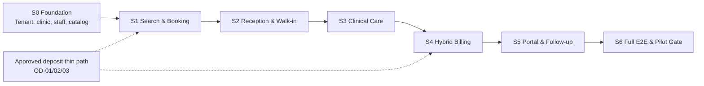
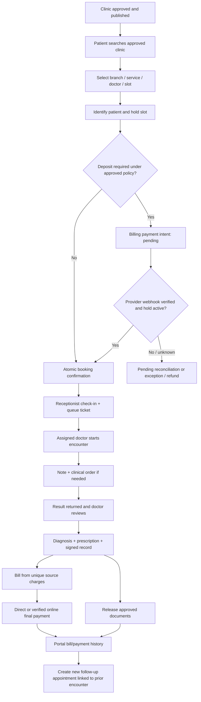
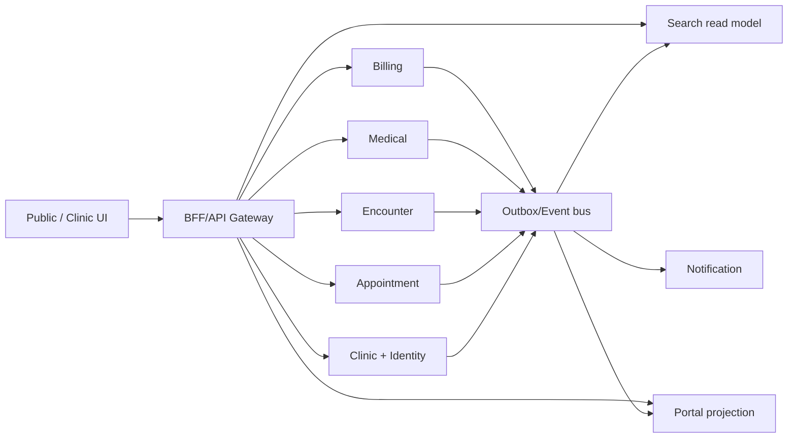
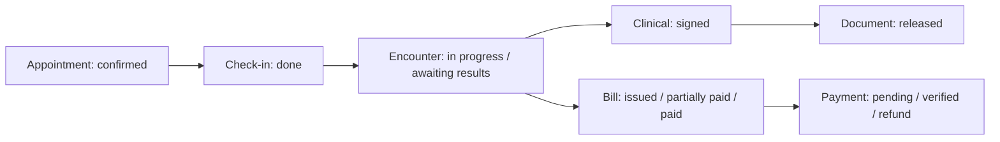

# 10 — Sơ đồ workflow & giao tiếp (Mermaid dạng tài liệu)

Sơ đồ này mô tả **thiết kế dự kiến** để review. Không khẳng định endpoint/service trong V1 đã triển khai. Xem Phase 03 diagrams để có ERD và lifecycle chi tiết.

## A. Phụ thuộc vertical slices


## B. Luồng online → khám → thanh toán → tái khám


## C. Walk-in không qua đặt lịch web
```mermaid
sequenceDiagram
  actor P as Patient at desk
  participant R as Receptionist
  participant PS as Patient Service
  participant ES as Encounter Service
  participant M as Medical
  participant B as Billing
  participant Portal as Portal
  P->>R: Present for care; no online account/booking
  R->>PS: Search verified administrative profile
  PS-->>R: Candidate matches for manual review
  R->>PS: Create or link provisional clinic patient
  R->>ES: Create walk-in visit (appointmentId=null)
  ES-->>R: Visit ID and branch queue ticket
  ES-->>M: Check-in event / assigned worklist
  M->>M: Exam; optional order, result, review; sign
  M-->>B: Unique billable source events
  R->>B: Take onsite payment and print correct receipt
  M-->>Portal: Release document reference
  P->>Portal: Verify identity and link account to own records
  Portal-->>P: Only released authorized documents
```

## D. Giao tiếp và tính nhất quán


**Ràng buộc quan trọng:** Client không gọi trực tiếp database, BFF không tự xác nhận thanh toán; portal access to document phải authorize ở server của record owner; Search availability chỉ là hint và booking phải revalidate nguồn.

## E. Trạng thái khác nhau của cùng một hành trình


Không ánh xạ tất cả các hộp thành một boolean `completed`: ký hồ sơ, đóng lượt khám, release tài liệu và thanh toán là các chuyển trạng thái độc lập.
