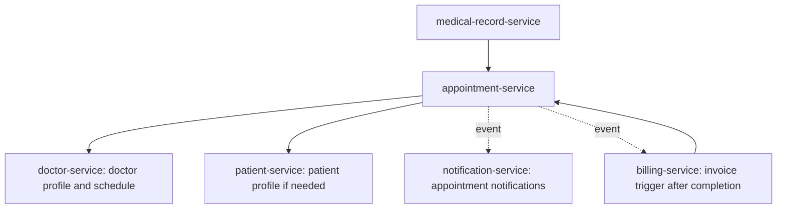

# Service Interaction Guide

## 1. Core Rule

Services communicate through APIs or events. They do not share repositories, entities, or direct database access.

Allowed:

- API Gateway for client-to-service routing
- OpenFeign for synchronous service-to-service calls
- events for asynchronous side effects when a broker is introduced
- shared stable primitives in `common-lib`

Not allowed:

- one service importing another service's repository
- one service querying another service's schema directly
- sharing JPA entities across services
- distributed transactions across services

## 2. Synchronous Calls

Use synchronous calls when the caller needs an immediate answer to complete the request.

Examples:

- `appointment-service` checks doctor availability from `doctor-service`.
- `medical-record-service` verifies appointment completion from `appointment-service`.
- `billing-service` verifies appointment or patient references before creating an invoice.

Rules:

- use OpenFeign
- set connection and read timeouts
- propagate Authorization header when required
- convert remote errors into local domain exceptions
- avoid repeated per-row calls in list endpoints

## 3. Asynchronous Events

Use events when the side effect does not need to block the client response.

Examples:

- appointment created -> send confirmation notification
- appointment cancelled -> send cancellation notification
- invoice paid -> send receipt notification
- medical record finalized -> trigger billing invoice generation

Target event names:

- `AppointmentCreated`
- `AppointmentConfirmed`
- `AppointmentCancelled`
- `AppointmentCompleted`
- `MedicalRecordFinalized`
- `InvoiceCreated`
- `InvoicePaid`
- `NotificationRequested`

## 4. JWT Propagation

When a service calls another protected service:

- read the inbound `Authorization` header
- forward it as `Authorization: Bearer <token>`
- never log token values
- remote service still validates the token independently

If internal service credentials are added later, document the trust model and keep user JWT and service identity separate.

## 5. Ownership And IDs

Cross-service IDs are external references:

- `patient-service.patients.id` may be referenced by appointments
- `doctor-service.doctors.id` may be referenced by appointments
- `identity-service.users.id` is referenced by patient and doctor profiles through `user_id`

Do not create cross-schema foreign keys. Validate references through service APIs at write time when needed.

## 6. Failure Handling

Recommended behavior:

- if a required synchronous validation service is down, return a clear business/system error
- if notification delivery fails, keep the main business transaction successful and retry notification separately
- if billing generation fails after appointment completion, keep an auditable state and retry or expose an admin repair action

Avoid cascading failures:

- set timeouts
- use fallback only when returning degraded but correct behavior is possible
- do not silently accept invalid business state because a remote service failed

## 7. Appointment Service Interaction Map

## 8. Contract Versioning

When a service changes an API consumed by another service:

- update the provider endpoint
- update the Feign client DTO
- update API docs
- run provider and consumer module tests
- preserve backward compatibility when reasonable

Breaking changes must be explicit. Do not silently change response fields used by another service.

